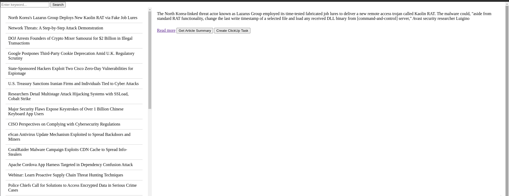
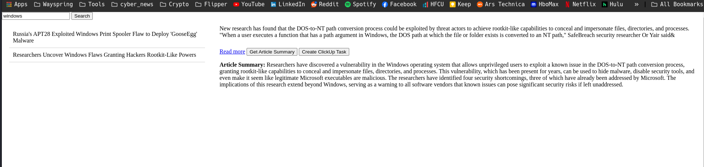
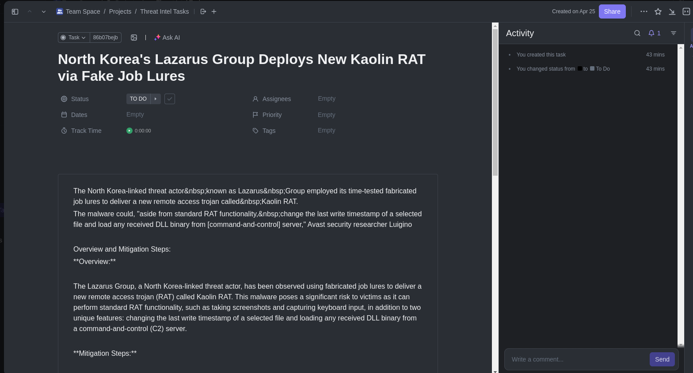
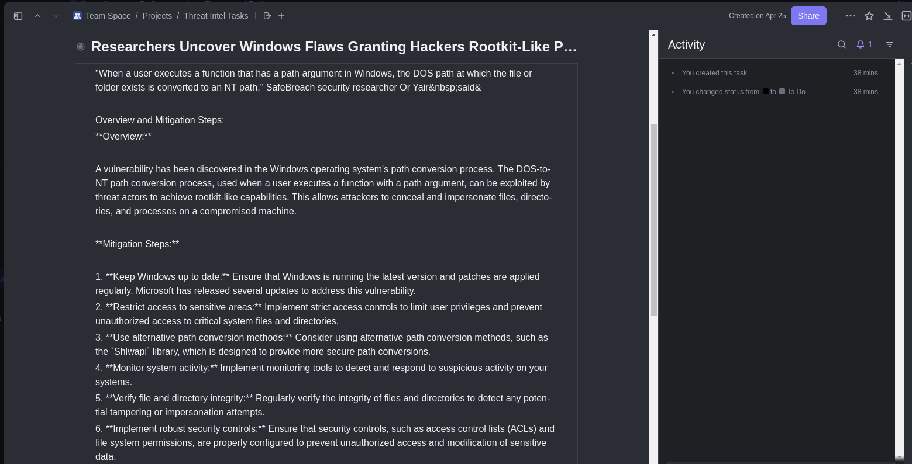

# Threat Intel Feed App
## RSS Feed Viewer and ClickUp Integration

## Project Description
This Flask application fetches articles from a specified RSS feed (The Hacker's News), displays them, and allows users to get a summary of the articles. Additionally, it features integration with ClickUp, allowing users to create tasks from these articles directly. This is particularly useful for teams looking to monitor and react to new updates or information seamlessly integrated into their project management workflow.

## Features
- Fetch articles from The Hacker News RSS feed.
- Display article titles in a scrollable list.
- Show article descriptions and provide a detailed summary using the Ollama LLM service.
- Create tasks in ClickUp based on article content with added mitigation and remediation steps via Ollama LLM.

## Future State
- GUI enhancements
- Chatbot to chat with about articles
- More threat feeds
- More ...
## Screenshots
### Main Dashbaord

### Dashboard filtered to "Windows" with a summary from Llama3

### ClickUp Tasks with summary and mitigation steps


## Installation

### Prerequisites
- Python 3.8+
- pip
- Virtualenv (recommended)

### Setup
1. **Clone the repository:**
   ```bash
   git clone https://github.com/yourusername/rss-feed-clickup.git
   cd rss-feed-clickup

2. **Set up a virtual environment (optional but recommended):**
    ```bash
   python -m venv venv
   source venv/bin/activate  # On Windows use `venv\Scripts\activate`
3. **Install the required packages:**
    ```bash
   pip install -r requirements.txt

4. **Set up environment variables:**
    Create a keys.py file in the root directory with the following content:
    ```bash
   clickup_api_key = 'your_clickup_api_key_here'
   list_id = 'your_clickup_list_id_here'
   
Replace your_clickup_api_key_here and your_clickup_list_id_here with your actual ClickUp API key and list ID.
    
# Usage

### To run the application:
    
        python app.py


Visit http://127.0.0.1:5000/ in your web browser to view and interact with the application.

# Contributing
Contributions to this project are welcome! Here are a few ways you can help:

Report bugs and issues.
Suggest new features or enhancements.
Improve the documentation or write tutorials.
Submit pull requests with bug fixes or new features.
Before contributing, please read the CONTRIBUTING.md (if available) or open an issue to discuss your ideas.

# License
This project is licensed under the MIT License - see the LICENSE file for details.